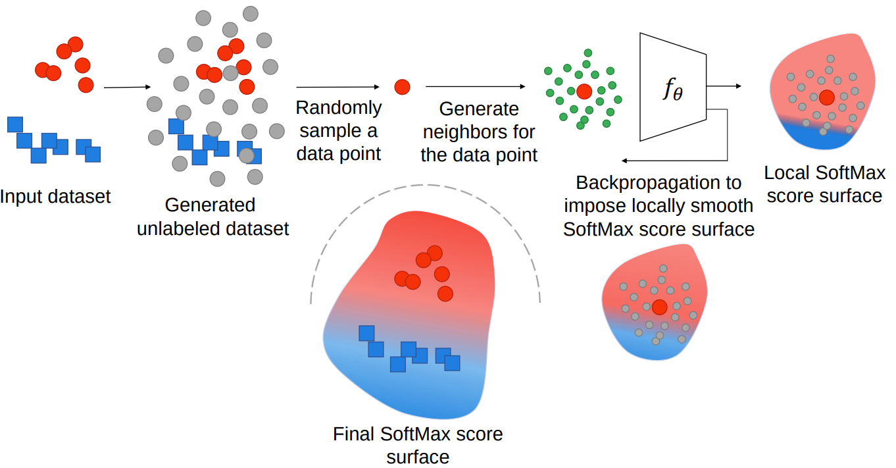

# Explaining Adversarial Vulnerability with a Data Sparsity Hypothesis

Despite many proposed algorithms to provide robustness to deep learning (DL) models, DL models remain susceptible to adversarial attacks. We hypothesize that the adversarial vulnerability of DL models stems from two factors. The first factor is data sparsity which is that in the high dimensional input data space, there exist large regions outside the support of the data distribution. The second factor is the existence of many redundant parameters in the DL models. Owing to these factors, different models are able to come up with different decision boundaries with comparably high prediction accuracy. The appearance of the decision boundaries in the space outside the support of the data distribution does not affect the prediction accuracy of the model. However, it makes an important difference in the adversarial robustness of the model. We hypothesize that the ideal decision boundary is as far as possible from the support of the class distributions.

In this project, we develop a training framework to observe if DL models are able to learn such a decision boundary spanning the space around the class distributions further from the data points themselves. Figure shows the pipeline for training such a DL model for the labeled dataset shown on the left with two class distributions (Circle and Square). For this training dataset an unlabeled dataset is generated to cover a large area around the labeled dataset in the high dimensiontal input data space. During training a data point is sampled from either the labeled or unlabeled dataset. The local SoftMax score surface around the sampled data point and the generated neighbors for that data point is made smooth using a regularizer. The final SoftMax score surface of the model for the labeled dataset is shown at the bottom of the figure. This SoftMax score surface is smooth and it's decision boundary stays away from the support of the class distributions in the input dataset. 

 

# Paper
Please cite our paper:

Paknezhad, M., Ngo, C. P., Winarto, A. A., Cheong, A., Yang, B. C., Jiayang, W., & Kuan, L. H. (2021). Explaining Adversarial Vulnerability with a Data Sparsity Hypothesis. arXiv preprint arXiv:2103.00778.

